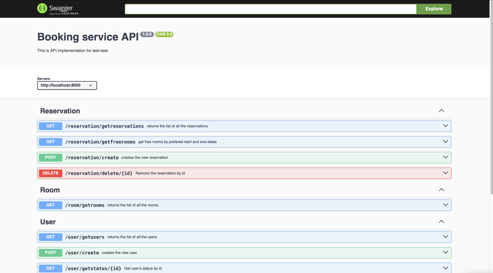

## booking_service API

This test-task for the company

Service allows you to manage data on cloud data-base (postgre):

1. get all users, rooms, reservations
2. check if there free rooms for particular dates
3. create new reservations, rooms, users
4. destroy reservations, room, users

[deploy](https://booking-service-api-xel2.onrender.com)

[swagger](https://booking-service-api-xel2.onrender.com/api-docs)

## Preview

## Stack

-   NodeJS
-   express
-   Sequelize (postgreSQL)
-   Swagger
